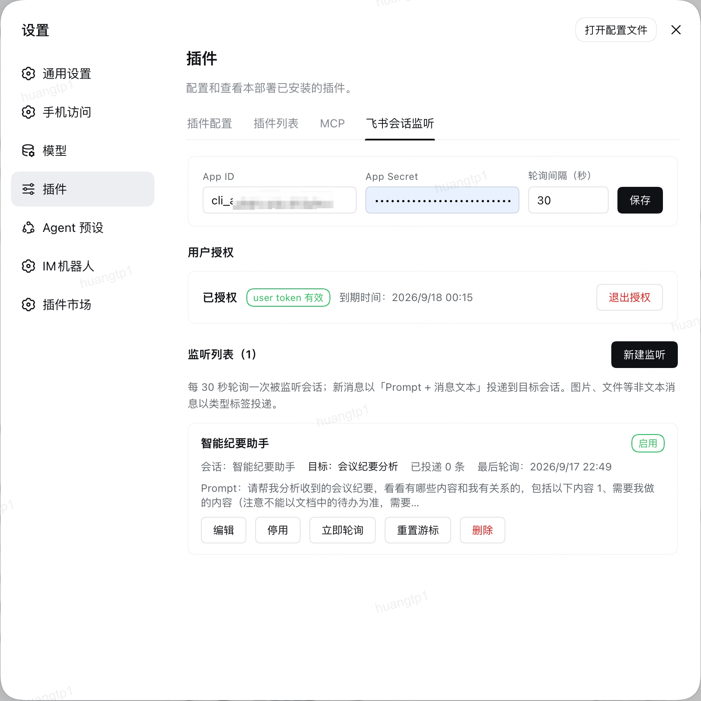

<div align="center">

# dsh-lark-session-monitor

**以你本人的身份监听飞书（Lark）会话，把新消息投递到指定的 DeepSeek Harness 会话。**

[English](./README.md) · **简体中文**



</div>

## 这是什么

一个 **DeepSeek Harness (DSH)** 插件，以**你本人的用户身份**读取飞书会话，把新消息作为 prompt 投递到你指定的 DSH 会话。

飞书没有用户身份的推送通道，因此采用轮询。

## 兼容的 DSH 版本

| DSH 版本 | 状态 |
| --- | --- |
| 0.1.5-rc.1 | **已实测** — 在真实 Web profile 中运行，含浏览器端的真实授权 |
| 0.1.5-rc.2 / 0.1.6-alpha.x | 预期可用；本插件使用的 DSH 接口在该区间内未变化 |

`peerDependencies` 接受 `0.1.x` 预发布线，拒绝 `0.2.0` 及以后版本。

> `@deepseek-ai/dsh-*` 在 npm 上的 `latest` 标签仍指向过期的 `0.0.1-rc.1`，请从 `next` 或 `alpha` 安装 DSH。

## 快速开始

需要 **Node.js ≥ 22.6**。

```bash
dsh plugin --profile web add github:REPLACE_OWNER/dsh-lark-session-monitor#v0.1.0
```

重启 DSH，然后刷新页面。打开 **设置 → 插件 → 飞书会话监听**。

<details>
<summary>升级或卸载</summary>

```bash
dsh plugin --profile web add github:REPLACE_OWNER/dsh-lark-session-monitor#v0.1.0
dsh plugin --profile web remove dsh-lark-session-monitor
```

</details>

## 配置步骤

### 1. 创建飞书应用

在[飞书开放平台](https://open.feishu.cn/app)创建自建应用，开通以下**用户**权限：

| 权限 | 用途 |
| --- | --- |
| `im:message.p2p_msg:get_as_user` | 读取你的私聊会话 |
| `im:message.group_msg:get_as_user` | 读取你的群会话 |
| `im:chat:read` | 解析会话名称 |
| `offline_access` | 免重复授权即可刷新 token |

把 **App ID** 与 **App Secret** 填入设置页并保存。

### 2. 授权

点击 **开始授权**，打开链接、在飞书中确认授权，然后点击 **我已完成授权**。

用户 token 保存在 DSH 的 **credentials** 服务中并自动刷新。Secret 与 token 都不会通过 RPC 返回。

### 3. 新建监听

点击 **新建监听**：

| 字段 | 含义 |
| --- | --- |
| **名称** | 可选标识 |
| **会话类型** | 把选择列表筛选为 全部 / 私聊 / 群 |
| **监听会话** | 要监听的会话；可输入文字筛选 |
| **Prompt** | 置于消息正文之前一并发送 |
| **目标工作区** | 目标会话所在的工作区 |
| **目标会话** | 留空则自动创建 |
| **启用** | 该监听是否参与轮询 |

## 投递机制

新消息合成一条 prompt 投递：

```text
<你的 prompt>

[发送者] 消息正文

[发送者] 第二条消息
```

**消息渲染。** 只有可读文本会被投递，飞书原始 JSON 不会进入 prompt。文本取其正文，富文本被展平，卡片取标题与摘要，图片/文件/音视频转为 `[图片]` 这样的标签。无可投递内容的消息会被跳过。

**目标会话。** `目标会话` 字段决定消息去向：

| 目标会话 | 自动创建并固定绑定 | 行为 |
| --- | --- | --- |
| 选中的会话 | — | 消息累积到该会话 |
| 留空 | ✅ | 首次投递创建会话并固定 |
| 留空 | ⬜ | 每条消息都新建一个会话 |

**轮询。** 同一监听同时只跑一轮。单条 prompt 最多 **10 条消息**，其余在本次投递后继续。游标只在投递成功后推进，因此投递失败会重读该批消息。

**目标被删除。** 会话被删除时，会在该监听的工作区内新建一个。而任何工作区都未声明过的 sessionId 会被报为配置错误，而不是替换。

## 设置项

| 设置 | 默认值 | 含义 |
| --- | --- | --- |
| **App ID** / **App Secret** | — | 保存时 Secret 留空表示保持不变 |
| **轮询间隔（秒）** | `30` | 最小 10 秒 |
| **Prompt** | — | 每个监听各自持有，投递时使用 |

存放于 `$DSH_HOME/plugin-data/dsh-lark-session-monitor/settings.json`，原子写入，权限 `0600`（含 App Secret）。

可选配置，写在 profile 的 `cordis.patch.yml`：

```yaml
- id: lark-session-monitor
  config:
    rpcAuthority: trusted-host   # 或 loopback
    autoStart: true              # Host 启动即开始轮询
    maxChats: 500                # 选择列表返回的会话上限
```

## 隐私

- 仅读取你配置的会话，以及轮询窗口内的消息。
- App Secret 存在设置文件，用户 token 存在 DSH 的 credentials 服务；两者都不会通过 RPC 返回。
- 唯一的网络访问是你授权的飞书 API 调用。没有遥测。
- 消息文本只交给你选定的 DSH 会话。插件不会向飞书回复。
- 设置端点走 DSH 已认证的 `/api` 通道。`rpcAuthority: loopback` 可额外要求回环 Host 与 Origin。

## 已知限制

- **仅文本。** 图片、文件、音视频以类型标签投递。
- **轮询而非推送。** 投递延迟受轮询间隔约束；离线期间的消息不会被补推（超出首次读取窗口的部分）。
- **仅支持飞书（Lark）。**

## 开发

```bash
npm install
npm run check     # 构建两端，然后运行测试
```

`lib/index.js`（Host）与 `lib/client.js`（浏览器）均已提交——git 安装不会执行构建，因此**改动 `src/` 后必须重新构建并提交 `lib/`**，CI 会在两者不一致时失败。

迭代时可把 checkout 链接进正在使用的 profile：

```bash
dsh plugin --profile web add /absolute/path/to/this/checkout
```

改动 Host 端后需重启 Host；仅改浏览器端刷新页面即可。

## 许可证

MIT — 见 [LICENSE](./LICENSE)。
