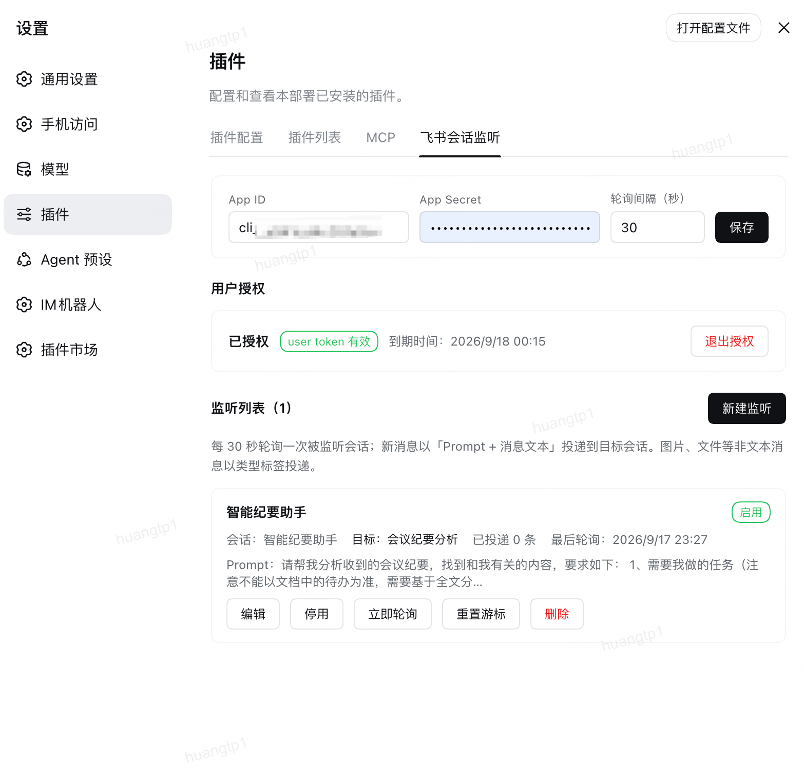

<div align="center">

# dsh-lark-session-monitor-plugin

**以你本人的身份监听飞书（Lark）会话，把新消息投递到指定的 DeepSeek Harness 会话。**

[English](./README.md) · **简体中文**



</div>

## 这是什么

一个 **DeepSeek Harness (DSH)** 插件，以**你本人的用户身份**读取飞书会话，把新消息作为 prompt 投递到你指定的 DSH 会话。


## 兼容的 DSH 版本

| DSH 版本 | 状态 |
| --- | --- |
| 0.1.5-rc.1 | **已实测** — 在真实 Web profile 中运行，含浏览器端的真实授权 |
| 0.1.5-rc.2 / 0.1.6-alpha.x | 预期可用；本插件使用的 DSH 接口在该区间内未变化 |

## 快速开始

需要 **Node.js ≥ 22.6**。

```bash
dsh plugin --profile web add github:lifeopsgo/dsh-lark-session-monitor-plugin#v1.2.0
```

重启 DSH，然后刷新页面。打开 **设置 → 插件 → 飞书会话监听**。

<details>
<summary>升级或卸载</summary>

```bash
dsh plugin --profile web add github:lifeopsgo/dsh-lark-session-monitor-plugin#v1.2.0
dsh plugin --profile web remove dsh-lark-session-monitor-plugin
```

</details>

## 配置步骤

### 1. 创建飞书应用

在[飞书开放平台](https://open.feishu.cn/app)创建自建应用，开通以下**用户**权限：

| 权限 | 用途 |
| --- | --- |
| `im:message.p2p_msg:get_as_user` | 读取你的私聊会话 |
| `im:message.group_msg:get_as_user` | 读取你的群会话 |
| `im:chat:read` | 解析会话名称 |
| `offline_access` | 免重复授权即可刷新 token |

把 **App ID** 与 **App Secret** 填入设置页并保存。

### 2. 授权

点击 **开始授权**，打开链接、在飞书中确认授权，然后点击 **我已完成授权**。

用户 token 保存在 DSH 的 **credentials** 服务中并自动刷新。Secret 与 token 都不会通过 RPC 返回。

### 3. 新建监听

点击 **新建监听**：

| 字段 | 含义 |
| --- | --- |
| **名称** | 可选标识 |
| **会话类型** | 把选择列表筛选为 全部 / 私聊 / 群 |
| **监听会话** | 要监听的会话；可输入文字筛选 |
| **Prompt** | 置于消息正文之前一并发送 |
| **目标工作区** | 目标会话所在的工作区 |
| **目标会话** | 留空则自动创建 |
| **过滤自己发送的消息** | 默认关闭；开启后不投递你本人发送的消息 |
| **仅接收指定发送者** | 默认留空 = 所有发送者；可多选会话中出现过的用户/机器人，仅投递其消息（读不到名称的机器人以 App ID 显示） |
| **也接收 @机器人 的消息** | 默认关闭；开启后 @本应用机器人 的消息即使发送者不在名单内也投递 |
| **启用** | 该监听是否参与轮询 |

## 投递机制

新消息合成一条 prompt 投递：

```text
<你的 prompt>

[发送者] [消息ID] 消息正文

[发送者] [消息ID] 第二条消息
```

**消息渲染。** 只有可读文本会被投递，飞书原始 JSON 不会进入 prompt。文本取其正文，富文本被展平，卡片按原始卡片 JSON（`card_msg_content_type=user_card_content`）读取并渲染成可读行——标题、正文、备注、按钮及其链接；链接只作为 URL 文本投递，不会抓取内容。图片/文件/音视频转为 `[图片]` 这样的标签。无可投递内容的消息会被跳过。每条投递都带飞书消息 ID，会话侧可以引用具体某条消息。

**目标会话。** `目标会话` 字段决定消息去向：

| 目标会话 | 自动创建并固定绑定 | 行为 |
| --- | --- | --- |
| 选中的会话 | — | 消息累积到该会话 |
| 留空 | ✅ | 首次投递创建会话并固定 |
| 留空 | ⬜ | 每条消息都新建一个会话 |

**轮询。** 同一监听同时只跑一轮。单条 prompt 最多 **10 条消息**，其余在本次投递后继续。游标只在投递成功后推进，因此投递失败会重读该批消息。

**自己的消息。** 监听可以过滤掉你本人发送的消息；若无法读取你的身份，则照旧投递。
**消息来源筛选。** 发送者名单把监听收窄到指定发送者（候选来自该会话最近的发言者）；「也接收 @机器人」把它放宽一格：@本应用机器人的消息即使发送者不在名单里也投递——被点名本身就是信号。名单留空 + 开关打开 = 只收 @机器人 的消息；两者都不设即照旧接收全部。机器人身份用应用自身的凭据解析，无需新增授权；解析失败时本轮挂起——不投递也不丢消息，每次轮询自动重试。

## 隐私

- 仅读取你配置的会话，以及轮询窗口内的消息。
- App Secret 存在设置文件，用户 token 存在 DSH 的 credentials 服务；两者都不会通过 RPC 返回。
- 唯一的网络访问是你授权的飞书 API 调用：用户 token 读取会话，应用自身凭据解析 @机器人 筛选所需的机器人身份。没有遥测。
- 消息文本只交给你选定的 DSH 会话。插件不会向飞书回复。
- 设置端点走 DSH 已认证的 `/api` 通道。`rpcAuthority: loopback` 可额外要求回环 Host 与 Origin。

## 已知限制

- **仅文本。** 图片、文件、音视频以类型标签投递。
- **轮询而非推送。** 投递延迟受轮询间隔约束；离线期间的消息不会被补推（超出首次读取窗口的部分）。

## 许可证

MIT — 见 [LICENSE](./LICENSE)。
